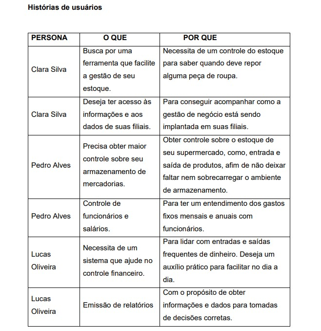
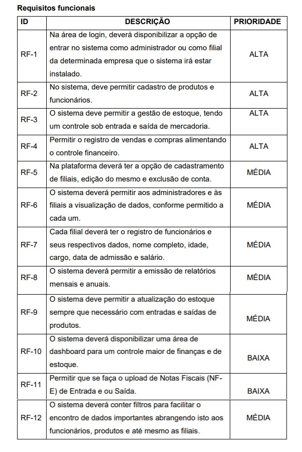

# Especificações do Projeto

 A definição exata do problema e os pontos mais relevantes a serem tratados neste 
projeto foi consolidada com a participação dos usuários em um trabalho de imersão 
feita pelos membros da equipe a partir da observação dos usuários em seu local 
natural e por meio de entrevistas. Os detalhes levantados nesse processo foram 
consolidados na forma de personas e histórias de usuários.

## Personas

O cliente ideal para AgilFornec engloba todos os microempreendedores e 
empreendedores de peque e média empresa, podendo também abranger para
empreendimentos grandes também. Segue exemplos de usuários fictícios que 
necessitam da utilização do sistema:

Clara Silva, 25 anos, empresária de uma loja de roupas. 
Motivação: busca por uma ferramenta que facilite a gestão de seu estoque, pedidos 
e clientes de forma mais ágil e eficiente.

Pedro Alves, 30 anos, dono de um supermercado.
Motivação: busca por uma plataforma que permita o gerenciamento de estoque, 
preços, pedidos e promoções de forma simplificada e integrada.

Lucas Oliveira, 22 anos, microempreendedor. 
Motivação: busca por uma plataforma que possibilite ter uma gestão financeira mais 
alinhada com o ideal para sua microempresa. Além disso, ele trabalha com muitos 
produtos diferentes e precisa ter um controle sob seu estoque.

## Histórias de Usuários

## Requisitos

O escopo funcional do projeto é definido por meio dos requisitos funcionais e não 
funcionais que são apresentados a seguir.

### Requisitos Funcionais

### Requisitos não Funcionais

## Restrições

As questões que limitam a execução desse projeto e que se configuram como 
obrigações claras para o desenvolvimento do projeto em questão são apresentadas 
na tabela a seguir.

## Diagrama de Casos de Uso

O diagrama contempla as principais ligações previstas entre casos de uso e atores 
e permite detalhar os Requisitos Funcionais identificados na etapa de licitação.

